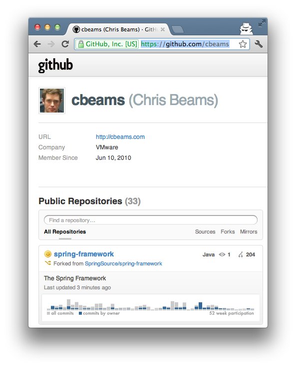
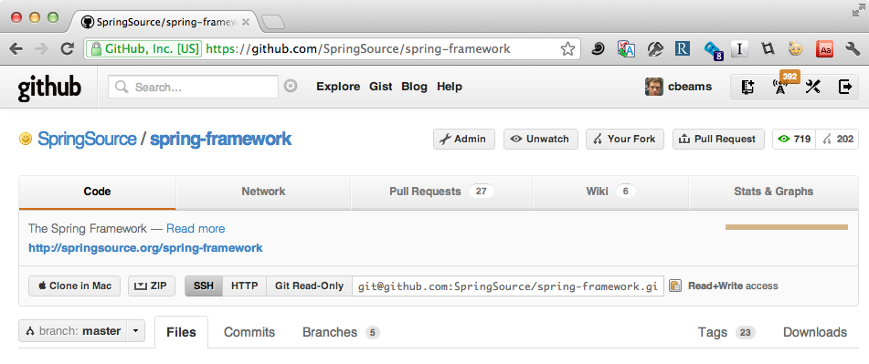
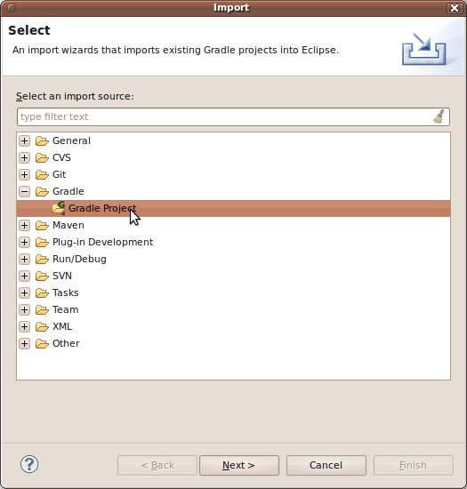
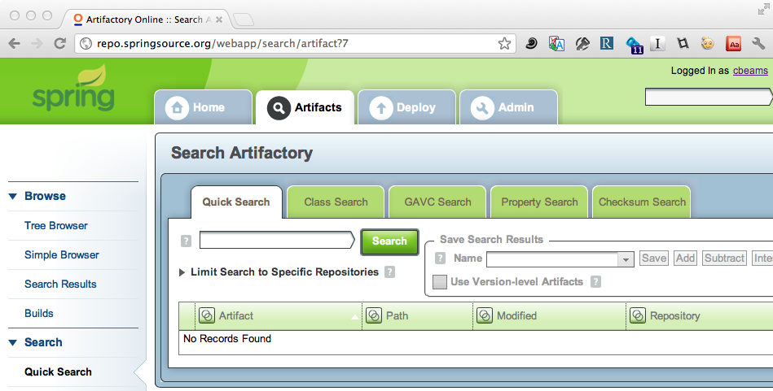

!SLIDE subsection
# Spring 3.1 review
## (and 3.2 preview)
  
## Chris Beams
### _SpringSource, VMware_

!SLIDE
# CHRIS BEAMS

!SLIDE center

!SLIDE
# YOU

!SLIDE transition=fade
# YOU ... ?

!SLIDE bullets transition=scrollUp
# THIS PRESENTATION
* [cbeams.github.com/spring-3.1-review](http://cbeams.github.com/spring-3.1-review)

!SLIDE subsection
# Spring 3.1

!SLIDE incremental bullets
# major themes
* first-class environment support
* code-based configuration
* new cache abstraction
* @MVC improvements
* third-party library and specification support

!SLIDE subsection
# Environment support

!SLIDE
# `Environment` API

!SLIDE incremental bullets
# `Environment` API
* injectable environment abstraction
* `org.springframework.core.env.Environment`

!SLIDE incremental bullets
# `Environment` API
* captures two key concepts
* _Property Sources_
* _Bean Definition Profiles_

!SLIDE incremental bullets
# `PropertySource` API
* abstraction for any source of key/value pairs
* `.properties` files
* system properties
* environment variables
* servlet context params
* JNDI

!SLIDE incremental bullets
# `PropertySource` API
* `Environment` maintains a hierarchy of `PropertySources`

!SLIDE incremental bullets
# `StandardEnvironment`
* includes by default `PropertySources` for:
* JVM system properties (`-D` flags)
* system environment variables
* suitable for use in standalone (i.e. non-web) apps

!SLIDE incremental bullets
# `Standard`*`Servlet`*`Environment`
* includes by default `PropertySources` for:
* JVM system properties (`-D` flags)
* system environment variables
* servlet config and context params
* JNDI

!SLIDE smaller incremental bullets
# Putting the `Environment` to use
* All Spring `ApplicationContext` types now contain an `Environment`
* You can create and register your own `Environment`
* And/or customize with your own `PropertySources`
* Using `ConfigurableEnvironment` API
* or with `@PropertySource` annotation

!SLIDE smaller incremental bullets
# `PropertySourcesPlaceholderResolver`
* new in `3.1`
* supersedes `PropertyPlaceholderResolver`
* automatically resolves `${...}` placeholders via the `Environment`
* used by default with `<context:property-placeholder/>`

!SLIDE smaller
# `PropertySourcesPlaceholderResolver`
    @@@ xml
    <beans ...>
      <context:property-placeholder
        location="classpath:com/company/db.properties"/>

      <bean id="dataSource"
        class="org.sfwk.jdbc.datasource.SimpleDriverDataSource">
          <property name="driverClass" value="${db.driver}"/>
          <property name="url" value="${db.driver}"/>
          <property name="username" value="${db.username}"/>
          <property name="password" value="${db.password}"/>
      </bean>

    </beans>

!SLIDE smaller
# `PropertySourcesPlaceholderResolver`
    @@@ xml
    <beans ...>
      <context:property-placeholder
        location="classpath:com/company/db.properties"/>

      <bean id="dataSource"
        class="org.sfwk.jdbc.datasource.SimpleDriverDataSource">
          <property name="driverClass" value="${db.driver}"/>
          <property name="url" value="${db.driver}"/>
          <property name="username" value="${db.username}"/>
          <property name="password" value="${db.password}"/>
      </bean> <!-- in 3.1, ${...} placeholders may be -->
              <!-- from 'db.properties' as well as all -->
              <!-- property sources registered with the -->
    </beans>  <!-- Environment -->

!SLIDE smaller
# `@Inject` the `Environment`
    @@@ java

    @Configuration
    public class DbConfig {

      @Bean
      public DataSource dataSource() {
        SimpleDriverDataSource ds = new SimpleDriverDataSource();

        return ds;
      }
    }

!SLIDE smaller
# `@Inject` the `Environment`
    @@@ java

    @Configuration
    public class DbConfig {

      @Bean
      public DataSource dataSource() {
        SimpleDriverDataSource ds = new SimpleDriverDataSource();

        // configure and return the data source ...

        return ds;
      }
    }

!SLIDE smaller
# `@Inject` the `Environment`
    @@@ java

    @Configuration
    public class DbConfig {

      @Bean
      public DataSource dataSource() {
        SimpleDriverDataSource ds = new SimpleDriverDataSource();
        ds.setDriverClass(...);
        ds.setUrl(...);
        ds.setUsername(...);
        ds.setPassword(...);
        return ds;
      }
    }

!SLIDE smaller
# `@Inject` the `Environment`
    @@@ java

    @Configuration
    public class DbConfig {

      @Bean
      public DataSource dataSource() {
        SimpleDriverDataSource ds = new SimpleDriverDataSource();
        ds.setDriverClass(...);
        ds.setUrl(...);         // where do these properties
        ds.setUsername(...);    // come from?
        ds.setPassword(...);
        return ds;
      }
    }

!SLIDE smaller
# `@Inject` the `Environment`
    @@@ java

    @Configuration
    public class DbConfig {

      @Bean
      public DataSource dataSource() {
        SimpleDriverDataSource ds = new SimpleDriverDataSource();
        ds.setDriverClass(...);
        ds.setUrl(...);
        ds.setUsername(...);
        ds.setPassword(...);
        return ds;
      }
    }

!SLIDE smaller
# `@Inject` the `Environment`
    @@@ java
    @PropertySource("classpath:/com/company/app/db.properties")
    @Configuration
    public class DbConfig {

      @Bean
      public DataSource dataSource() {
        SimpleDriverDataSource ds = new SimpleDriverDataSource();
        ds.setDriverClass(...);
        ds.setUrl(...);
        ds.setUsername(...);
        ds.setPassword(...);
        return ds;
      }
    }

!SLIDE smaller
# `@Inject` the `Environment`
    @@@ java
    @PropertySource("classpath:/com/company/app/db.properties")
    @Configuration
    public class DbConfig {

      @Inject Environment env;

      @Bean
      public DataSource dataSource() {
        SimpleDriverDataSource ds = new SimpleDriverDataSource();
        ds.setDriverClass(...);
        ds.setUrl(...);
        ds.setUsername(...);
        ds.setPassword(...);
        return ds;
      }
    }

!SLIDE smaller
# `@Inject` the `Environment`
    @@@ java
    @PropertySource("classpath:/com/company/app/db.properties")
    @Configuration
    public class DbConfig {

      @Inject Environment env; // injected from the enclosing
                               // ApplicationContext
      @Bean
      public DataSource dataSource() {
        SimpleDriverDataSource ds = new SimpleDriverDataSource();
        ds.setDriverClass(...);
        ds.setUrl(...);
        ds.setUsername(...);
        ds.setPassword(...);
        return ds;
      }
    }

!SLIDE smaller
# `@Inject` the `Environment`
    @@@ java
    @PropertySource("classpath:/com/company/app/db.properties")
    @Configuration
    public class DbConfig {

      @Inject Environment env;

      @Bean
      public DataSource dataSource() {
        SimpleDriverDataSource ds = new SimpleDriverDataSource();
        ds.setDriverClass(...);
        ds.setUrl(...);
        ds.setUsername(...);
        ds.setPassword(...);
        return ds;
      }
    }

!SLIDE smaller
# `@Inject` the `Environment`
    @@@ java
    @PropertySource("classpath:/com/company/app/db.properties")
    @Configuration
    public class DbConfig {

      @Inject Environment env;

      @Bean
      public DataSource dataSource() {
        SimpleDriverDataSource ds = new SimpleDriverDataSource();
        ds.setDriverClass(env.getPropertyAsClass("db.driver"));
        ds.setUrl(...);
        ds.setUsername(...);
        ds.setPassword(...);
        return ds;
      }
    }

!SLIDE smaller
# `@Inject` the `Environment`
    @@@ java
    @PropertySource("classpath:/com/company/app/db.properties")
    @Configuration
    public class DbConfig {

      @Inject Environment env;

      @Bean
      public DataSource dataSource() {
        SimpleDriverDataSource ds = new SimpleDriverDataSource();
        ds.setDriverClass(env.getPropertyAsClass("db.driver"));
        ds.setUrl(env.getProperty("db.url"));
        ds.setUsername(...);
        ds.setPassword(...);
        return ds;
      }
    }

!SLIDE smaller
# `@Inject` the `Environment`
    @@@ java
    @PropertySource("classpath:/com/company/app/db.properties")
    @Configuration
    public class DbConfig {

      @Inject Environment env;

      @Bean
      public DataSource dataSource() {
        SimpleDriverDataSource ds = new SimpleDriverDataSource();
        ds.setDriverClass(env.getPropertyAsClass("db.driver"));
        ds.setUrl(env.getProperty("db.url"));
        ds.setUsername(env.getProperty("db.username"));
        ds.setPassword(...);
        return ds;
      }
    }

!SLIDE smaller
# `@Inject` the `Environment`
    @@@ java
    @PropertySource("classpath:/com/company/app/db.properties")
    @Configuration
    public class DbConfig {

      @Inject Environment env;

      @Bean
      public DataSource dataSource() {
        SimpleDriverDataSource ds = new SimpleDriverDataSource();
        ds.setDriverClass(env.getPropertyAsClass("db.driver"));
        ds.setUrl(env.getProperty("db.url"));
        ds.setUsername(env.getProperty("db.username"));
        ds.setPassword(env.getProperty("db.password"));
        return ds;
      }
    }

!SLIDE smaller
# `@Inject` the `Environment`
    @@@ java
    @PropertySource("classpath:/com/company/app/db.properties")
    @Configuration
    public class DbConfig {

      @Inject Environment env;

      @Bean
      public DataSource dataSource() {
        SimpleDriverDataSource ds = new SimpleDriverDataSource();
        ds.setDriverClass(env.getPropertyAsClass("db.driver"));
        ds.setUrl(env.getProperty("db.url"));
        ds.setUsername(env.getProperty("db.username"));
        ds.setPassword(env.getProperty("db.password"));
        return ds; // property values may be resolved from
      }            // 'db.properties' or any other PropertySource
    }              // registered with the Environment

!SLIDE
# bean definition `profiles`

!SLIDE incremental bullets
# bean definition `profiles`
* a logical group of bean definitions
* registered only if the profile is *active*

!SLIDE smaller
# abc-config.xml
    @@@ xml
    <beans>
      <bean id="a" class="com.company.A"/>
      <bean id="b" class="com.company.B"/>
      <bean id="c" class="com.company.C"/>
    </beans>

# Main.java
    @@@ java
    public static void main(String... args) {
        GenericXmlApplicationContext ctx = new GXAC();

        ctx.load("classpath:com/company/*-config.xml");
        ctx.refresh();
        ctx.getBean("a"); // ...

    }

!SLIDE smaller
# abc-config.xml
    @@@ xml
    <beans profile="dev">
      <bean id="a" class="com.company.A"/>
      <bean id="b" class="com.company.B"/>
      <bean id="c" class="com.company.C"/>
    </beans>

# Main.java
    @@@ java
    public static void main(String... args) {
        GenericXmlApplicationContext ctx = new GXAC();

        ctx.load("classpath:com/company/*-config.xml");
        ctx.refresh();
        ctx.getBean("a"); // ...

    }

!SLIDE smaller
# abc-config.xml
    @@@ xml
    <beans profile="dev"> <!-- only register if "dev" active -->
      <bean id="a" class="com.company.A"/>
      <bean id="b" class="com.company.B"/>
      <bean id="c" class="com.company.C"/>
    </beans>

# Main.java
    @@@ java
    public static void main(String... args) {
        GenericXmlApplicationContext ctx = new GXAC();

        ctx.load("classpath:com/company/*-config.xml");
        ctx.refresh();
        ctx.getBean("a"); // ...

    }

!SLIDE smaller
# abc-config.xml
    @@@ xml
    <beans profile="dev"> <!-- only register if "dev" active -->
      <bean id="a" class="com.company.A"/>
      <bean id="b" class="com.company.B"/>
      <bean id="c" class="com.company.C"/>
    </beans>

# Main.java
    @@@ java
    public static void main(String... args) {
        GenericXmlApplicationContext ctx = new GXAC();

        ctx.load("classpath:com/company/*-config.xml");
        ctx.refresh();
        ctx.getBean("a"); // oops! "dev" profile not active,
                          // so bean "a" is not found
    }

!SLIDE smaller
# abc-config.xml
    @@@ xml
    <beans profile="dev"> <!-- only register if "dev" active -->
      <bean id="a" class="com.company.A"/>
      <bean id="b" class="com.company.B"/>
      <bean id="c" class="com.company.C"/>
    </beans>

# Main.java
    @@@ java
    public static void main(String... args) {
        GenericXmlApplicationContext ctx = new GXAC();

        ctx.load("classpath:com/company/*-config.xml");
        ctx.refresh();
        ctx.getBean("a");

    }

!SLIDE smaller
# abc-config.xml
    @@@ xml
    <beans profile="dev"> <!-- only register if "dev" active -->
      <bean id="a" class="com.company.A"/>
      <bean id="b" class="com.company.B"/>
      <bean id="c" class="com.company.C"/>
    </beans>

# Main.java
    @@@ java
    public static void main(String... args) {
        GenericXmlApplicationContext ctx = new GXAC();
        ctx.getEnvironment().setActiveProfiles("dev");
        ctx.load("classpath:com/company/*-config.xml");
        ctx.refresh();
        ctx.getBean("a");

    }

!SLIDE smaller
# abc-config.xml
    @@@ xml
    <beans profile="dev"> <!-- only register if "dev" active -->
      <bean id="a" class="com.company.A"/>
      <bean id="b" class="com.company.B"/>
      <bean id="c" class="com.company.C"/>
    </beans>

# Main.java
    @@@ java
    public static void main(String... args) {
        GenericXmlApplicationContext ctx = new GXAC();
        ctx.getEnvironment().setActiveProfiles("dev");
        ctx.load("classpath:com/company/*-config.xml");
        ctx.refresh();
        ctx.getBean("a"); // "dev" profile is active, so
                          // bean "a" is available
    }

!SLIDE small incremental bullets
# profile use cases
* differing configurations across dev/test/prod lifecycle
* customer A vs. customer B deployments
* portability across traditional and cloud environments
* ...

!SLIDE smaller
# dev-datasource-config.xml
    @@@ xml
    <beans profile="dev">

      <bean id="dataSource" class="org.opensource.InMemoryDB">
        <property name="driverClass" value="..."/>
        <property name="url" value="..."/>
        <property name="username" value="..."/>
        <property name="password" value="..."/>
      </bean>

    </beans>

!SLIDE smaller transition=scrollUp
# dev-datasource-config.xml
    @@@ xml
    <beans profile="dev">

      <bean id="dataSource" class="org.opensource.InMemoryDB">
        <property name="driverClass" value="..."/>
        <property name="url" value="..."/>
        <property name="username" value="..."/>
        <property name="password" value="..."/>
      </bean>

    </beans>

# prod-datasource-config.xml
    @@@ xml
    <beans profile="prod">

      <jee:jndi-lookup id="dataSource"
                jndi-name="java:comp/env/jdbc/myds"/>

    </beans>

!SLIDE
# nested `<beans/>`

!SLIDE smaller
# datasource-config.xml
    @@@ xml
    <beans>

      <beans profile="dev">

      </beans>

      <beans profile="prod">

      </beans>

    </beans>

!SLIDE smaller
# datasource-config.xml
    @@@ xml
    <beans>

      <beans profile="dev">
        <bean id="dataSource" class="org.opensource.InMemoryDB">
          <property name="driverClass" value="..."/>
          <property name="url" value="..."/>
          <property name="username" value="..."/>
          <property name="password" value="..."/>
        </bean>
      </beans>

      <beans profile="prod">

      </beans>

    </beans>

!SLIDE smaller
# datasource-config.xml
    @@@ xml
    <beans>

      <beans profile="dev">
        <bean id="dataSource" class="org.opensource.InMemoryDB">
          <property name="driverClass" value="..."/>
          <property name="url" value="..."/>
          <property name="username" value="..."/>
          <property name="password" value="..."/>
        </bean>
      </beans>

      <beans profile="prod">
        <jee:jndi-lookup id="dataSource"
                  jndi-name="java:comp/env/jdbc/myds"/>
      </beans>

    </beans>

!SLIDE
# profile activation

!SLIDE small
# programmatic
    @@@ java
    GenericApplicationContext ctx = ...;

    ctx.getEnvironment().setActiveProfiles("dev");

    ctx.refresh();

    // ...

!SLIDE small
# declarative: JVM system props
    @@@
      spring.profiles.active

!SLIDE small transition=fade
# declarative: JVM system props
    @@@
    -Dspring.profiles.active=p1,p2,p3

!SLIDE smaller
# declarative: web.xml
    @@@xml
    <web-app>
      <servlet>
        <servlet-name>main</servlet-name>
        <servlet-class>
          org.springframework.web.servlet.DispatcherServlet
        </servlet-class>
        <init-param>
          <param-name>spring.profiles.active</param-name>
          <param-value>p1,p2,p3</param-value>
        </init-param>
        <init-param>
          <param-name>contextConfigLocation</param-name>
          <param-value>
            /WEB-INF/spring/dispatcher-config.xml
          </param-value>
        </init-param>
        <load-on-startup>1</load-on-startup>
      </servlet>
      <!-- ... -->
    <web-app>

!SLIDE smaller transition=fade
# declarative: web.xml
    @@@xml
    <web-app>
      <servlet>

        <init-param>
          <param-name>spring.profiles.active</param-name>
          <param-value>p1,p2,p3</param-value>
        </init-param>

      </servlet>
      <!-- ... -->
    <web-app>

!SLIDE subsection
# Code-based configuration

!SLIDE
# Goal: 100% XML-free application configuration

!SLIDE incremental bullets
# `@Configuration`, completed
* Spring 3.0 introduced the `@Configuration` class

!SLIDE small
# app-config.xml
    @@@ xml
    <beans>
        <bean id="foo" class="com.company.Foo">
            <property name="bar" ref="bar"/>
        </bean>

        <bean id="bar" class="com.company.Bar"/>
    </beans>

# ...
    @@@ java
    new GenericXmlApplicationContext("app-config.xml");

!SLIDE smaller transition=scrollLeft
# AppConfig.java
    @@@ java
    @Configuration
    public class AppConfig {

        @Bean
        public Foo foo() {
            Foo foo = new Foo();
            foo.setBar(bar());
            return foo;
        }

        @Bean
        public Bar bar() {
            return new Bar();
        }
    }

# ...
    @@@ java
    new AnnotationConfigApplicationContext(AppConfig.class);

!SLIDE bullets incremental
# `@Configuration` in Spring 3.0
* works well, but incomplete
* e.g. no equivalent to Spring XML namespaces

!SLIDE smaller
# XML namespaces
    @@@ xml
    <beans>

    </beans>

!SLIDE smaller
# XML namespaces
    @@@ xml
    <beans>
        <!-- scan for all @Component-annotated classes -->
        <context:component-scan base-package="com.company"/>

    </beans>

!SLIDE smaller
# XML namespaces
    @@@ xml
    <beans>
        <!-- scan for all @Component-annotated classes -->
        <context:component-scan base-package="com.company"/>

        <!-- handle any @Transactional annotations -->
        <tx:annotation-driven/>

    </beans>

!SLIDE smaller
# XML namespaces
    @@@ xml
    <beans>
        <!-- scan for all @Component-annotated classes -->
        <context:component-scan base-package="com.company"/>

        <!-- handle any @Transactional annotations -->
        <tx:annotation-driven/>

        <!-- handle any @Scheduled annotations -->
        <task:annotation-driven/>

    </beans>

!SLIDE smaller
# XML namespaces
    @@@ xml
    <beans>
        <!-- scan for all @Component-annotated classes -->
        <context:component-scan base-package="com.company"/>

        <!-- handle any @Transactional annotations -->
        <tx:annotation-driven/>

        <!-- handle any @Scheduled annotations -->
        <task:annotation-driven/>

        <!-- ... -->
    </beans>

!SLIDE
# `@Enable*` annotations

!SLIDE small bullets incremental
# `@Enable*` and `@ComponentScan`
* provide the missing equivalent to XML namespaces

!SLIDE smaller
    @@@ xml
    <beans>
        <context:component-scan base-package="com.company"/>

        <tx:annotation-driven/>

        <task:annotation-driven/>

        <!-- ... -->
    </beans>

!SLIDE smaller transition=scrollLeft
    @@@ java
    @Configuration
    @ComponentScan("com.company")
    @EnableTransactionManagement
    @EnableScheduling
    public class AppConfig {
        // ...
    }

!SLIDE smaller
    @@@ java
    @Configuration
    @ComponentScan("com.company") // ~= context:component-scan
    @EnableTransactionManagement
    @EnableScheduling
    public class AppConfig {
        // ...
    }

!SLIDE smaller
    @@@ java
    @Configuration
    @ComponentScan("com.company")
    @EnableTransactionManagement  // ~= tx:annotation-driven
    @EnableScheduling
    public class AppConfig {
        // ...
    }

!SLIDE smaller
    @@@ java
    @Configuration
    @ComponentScan("com.company")
    @EnableTransactionManagement
    @EnableScheduling             // ~= task:annotation-driven
    public class AppConfig {
        // ...
    }

!SLIDE small bullets
* `@ComponentScan`
* `@EnableAspectJAutoProxy`
* `@EnableAsync`
* `@EnableCaching`
* `@EnableLoadTimeWeaving`
* `@EnableSpringConfigured`
* `@EnableTransactionManagement`
* `@EnableWebMvc`

!SLIDE small bullets incremental
# design goals for `@Enable*` annotations
* transparency
* flexibility
* extensibility

!SLIDE bullets incremental
# `@Profile` annotation
* equivalent to `<beans profile="..."/>`

!SLIDE
# abc-config.xml
    @@@ xml
    <beans profile="dev">
      <bean id="a" class="com.company.A"/>
      <bean id="b" class="com.company.B"/>
      <bean id="c" class="com.company.C"/>
    </beans>

!SLIDE transition=scrollLeft
# AbcConfig.xml
    @@@ java
    @Configuration

    public class AbcConfig {
        @Bean A a() { return new A(); }
        @Bean B b() { return new B(); }
        @Bean C c() { return new C(); }
    }

!SLIDE
# AbcConfig.xml
    @@@ java
    @Configuration
    @Profile("dev")
    public class AbcConfig {
        @Bean A a() { return new A(); }
        @Bean B b() { return new B(); }
        @Bean C c() { return new C(); }
    }

!SLIDE
# `@Configuration` support in TestContext framework

!SLIDE incremental bullets
# TestContext framework
* `@ContextConfiguration` and friends
* introduced in Spring 2.5
* big help with integration tests
* until 3.1, worked only with XML

!SLIDE smaller
    @@@ java
    @RunWith(SpringJunit4ClassRunner.class)
    @ContextConfiguration(locations="app-config.xml")
    public class IntegrationTest {
        @Autowired MyService myService;

        @Test
        public void testServiceMethods() {
            // ...
        }
    }

!SLIDE smaller
    @@@ java
    @RunWith(SpringJunit4ClassRunner.class)
    @ContextConfiguration(locations="app-config.xml")
    public class IntegrationTest {
        @Autowired MyService myService; // inject a <bean>

        @Test
        public void testServiceMethods() {
            // ...
        }
    }

!SLIDE smaller
    @@@ java
    @RunWith(SpringJunit4ClassRunner.class)
    @ContextConfiguration(locations="app-config.xml")
    public class IntegrationTest {

    }

!SLIDE smaller transition=fade
    @@@ java
    @RunWith(SpringJunit4ClassRunner.class)
    @ContextConfiguration(classes=AppConfig.class)
    public class IntegrationTest {

    }

!SLIDE smaller
    @@@ java
    @RunWith(SpringJunit4ClassRunner.class)
    @ContextConfiguration(classes=AppConfig.class) // new in 3.1
    public class IntegrationTest {

    }

!SLIDE smaller transition=fade
    @@@ java
    @RunWith(SpringJunit4ClassRunner.class)
    @ContextConfiguration(classes=AppConfig.class)
    public class IntegrationTest {
        @Autowired MyService myService;

        @Test
        public void testServiceMethods() {
            // ...
        }
    }

!SLIDE smaller
    @@@ java
    @RunWith(SpringJunit4ClassRunner.class)
    @ContextConfiguration(classes=AppConfig.class)
    public class IntegrationTest {
        @Autowired MyService myService; // inject a @Bean

        @Test
        public void testServiceMethods() {
            // ...
        }
    }

!SLIDE
# XML-free servlet container configuration

!SLIDE incremental bullets
# `WebApplicationInitializer`
* Spring 3.1 introduces `WebApplicationInitializer` API
* builds on Servlet 3.0 `ServletContainerInitializer`
* auto-detected on servlet container startup
* eliminates need for `web.xml` entirely

!SLIDE smaller
# traditional web.xml
    @@@ xml
    <web-app>
      <servlet>
        <servlet-name>main</servlet-name>
        <servlet-class>
          org.springframework.web.servlet.DispatcherServlet
        </servlet-class>
        <init-param>
          <param-name>contextConfigLocation</param-name>
          <param-value>
            /WEB-INF/spring/dispatcher-config.xml
          </param-value>
        </init-param>
        <load-on-startup>1</load-on-startup>
      </servlet>
      <servlet-mapping>
        <servlet-name>main</servlet-name>
        <url-pattern>/</url-pattern>
      </servlet-mapping>
    <web-app>

!SLIDE smaller
# `WebApplicationInitializer` equivalent
    @@@ java
    public class MyWAI implements WebApplicationInitializer {

       @Override
       public void onStartup(ServletContext servletContext) {
         XmlWebApplicationContext appContext =
           new XmlWebApplicationContext()

         appContext.setConfigLocation(
           "/WEB-INF/spring/dispatcher-config.xml");

         Dynamic servlet = servletContext.addServlet(
            "main", new DispatcherServlet(appContext));
         servlet.addMapping("/");
         servlet.setLoadOnStartup(1);
       }

    }

!SLIDE smaller transition=fade
# even better - 100% XML-free
    @@@ java
    public class MyWAI implements WebApplicationInitializer {

       @Override
       public void onStartup(ServletContext servletContext) {
         AnnotationConfigWebApplicationContext appContext =
           new AnnotationConfigWebApplicationContext()

         appContext.register(AppConfig.class);

         Dynamic servlet = servletContext.addServlet(
            "main", new DispatcherServlet(ctx));

         servlet.addMapping("/");
         servlet.setLoadOnStartup(1);
       }

    }

!SLIDE
# XML-free JPA

!SLIDE smaller
# persistence.xml
    @@@ xml
    <persistence xmlns="http://java.sun.com/xml/ns/persistence"
                 xmlns:xsi="..."
                 xsi:schemaLocation="..."
                 version="2.0">
       <persistence-unit name="sample">
          <jta-data-source>java:/DefaultDS</jta-data-source>
          <properties>
             <property name="hibernate.dialect"
                     value="org.hibernate.dialect.HSQLDialect"/>
          </properties>
       </persistence-unit>
    </persistence>

!SLIDE smaller
    @@@ java
    @Bean
    public LocalContainerEntityManagerFactoryBean emf() {
        LocalContainerEntityManagerFactoryBean emf =
            new LocalContainerEntityManagerFactoryBean();
        emf.setDataSource(dataSource());
        emf.setPersistenceXmlLocation(
            "classpath:META-INF/persistence.xml");
        return emf;
    }

!SLIDE smaller
    @@@ java
    @Bean
    public LocalContainerEntityManagerFactoryBean emf() {
        LocalContainerEntityManagerFactoryBean emf =
            new LocalContainerEntityManagerFactoryBean();
        emf.setDataSource(dataSource());
        emf.setPersistenceXmlLocation(
            "classpath:META-INF/persistence.xml"); // no more!
        return emf;
    }

!SLIDE smaller
    @@@ java
    @Bean
    public LocalContainerEntityManagerFactoryBean emf() {
        LocalContainerEntityManagerFactoryBean emf =
            new LocalContainerEntityManagerFactoryBean();
        emf.setDataSource(dataSource());

        emf.setPackagesToScan("com.biz.app");
        return emf;
    }

!SLIDE smaller
    @@@ java
    @Bean
    public LocalContainerEntityManagerFactoryBean emf() {
        LocalContainerEntityManagerFactoryBean emf =
            new LocalContainerEntityManagerFactoryBean();
        emf.setDataSource(dataSource());
        // scan classpath for JPA @Entity types
        emf.setPackagesToScan("com.biz.app");
        return emf;
    }

!SLIDE
# XML-free Hibernate configuration

!SLIDE incremental bullets
# Hibernate 4 support
* Spring 3.1 builds against Hib 4.1
* new `orm.hibernate4` packaging

!SLIDE smaller
# familiar?
    @@@ xml
    <bean id="sessionFactory"
        class="org.sfwk.orm.hibernate3.LocalSessionFactoryBean">
      <property name="dataSource" ref="myDataSource"/>
      <property name="mappingResources">
        <list>
          <value>Person.hbm.xml</value>
          <value>Account.hbm.xml</value>
        </list>
      </property>
      <property name="hibernateProperties">
        <value>
          hibernate.dialect=org.hibernate.dialect.HSQLDialect
        </value>
      </property>
    </bean>

!SLIDE smaller
# or even
    @@@ xml
    <bean id="sessionFactory"
        class="org.sfwk.orm.hib3.AnnotationSessionFactoryBean">
      <property name="dataSource" ref="myDataSource"/>
      <property name="annotatedClasses">
        <list>
          <value>com.foo.Person</value>
          <value>com.foo.Account</value>
        </list>
      </property>
      <property name="hibernateProperties">
        <value>
          hibernate.dialect=org.hibernate.dialect.HSQLDialect
        </value>
      </property>
    </bean>

!SLIDE smaller
# We can do better than that.

!SLIDE smaller
    @@@ java
    @Bean
    public SessionFactory sessionFactory() {
        return new LocalSessionFactoryBuilder(dataSource())
            .addAnnotatedClasses(Person.class, Account.class)
            .buildSessionFactory();
    }

!SLIDE incremental bullets
# `LocalSessionFactoryBuilder`
* extends Hibernate&apos;s own `Configuration` class
* only in the new `orm.hibernate4` package

!SLIDE smaller
# also...

!SLIDE smaller
# standalone Hibernate exception translator
    @@@ java
    @Bean
    public SessionFactory sessionFactory() {
        return new LocalSessionFactoryBuilder(dataSource())
            .addAnnotatedClasses(Person.class, Account.class)
            .buildSessionFactory();
    }

    @Bean
    public PersistenceExceptionTranslator exTranslator() {
        return new HibernateExceptionTranslator();
    }

!SLIDE incremental bullets
* <del>application-context.xml</del>
* <del>persistence.xml</del>
* <del>web.xml</del>

!SLIDE incremental bullets
# _comprehensive_ code-based config
* Spring 3.0 began the work
* Spring 3.1 completes it

!SLIDE incremental bullets
# _"but what about XML?"_
* don&apos;t worry...
* Spring XML will always remain first-class
* code config is there for those that _want_ it

!SLIDE subsection
# New cache abstraction

!SLIDE incremental bullets
# declarative caching for Spring-managed beans
* minimal impact on code
* plug in various cache providers

!SLIDE incremental bullets
# key annotations
* `@Cacheable`
* `@CacheEvict`

!SLIDE smaller

    @@@ java
    @Cacheable("books")
    public Book findBook(ISBN isbn) {
        return this.bookRepository.findBook(isbn);
    }

    @CacheEvict(value="books", allEntries=true)
    public void loadBooks(InputStream batch) {
        // ...
    }

!SLIDE incremental bullets
# `Cache` and `CacheManager` SPI
* in new `org.springframework.cache` package

!SLIDE bullets incremental
# enable caching support
* with new `<cache:*>` XML namespace
* or new `@EnableCaching` annotation

!SLIDE smaller
# `<cache:*>` namespace
    @@@ xml
    <cache:annotation-driven/>

    <bean id="cacheManager"
          class="org.sfwk.cache.support.SimpleCacheManager"/>
      <property name="caches">
        <bean class="org.sfwk...ConcurrentMapCacheFactoryBean">
           <property name="name" value="books"/>
        </bean>
      </property>
    </bean>

!SLIDE smaller
# `@EnableCaching` annotation
    @@@ java
    @Configuration
    @EnableCaching
    class AppConfig {

        @Bean
        public CacheManager cacheManager() {
            ConcurrentMapCacheManager mgr =
                new ConcurrentMapCacheManager();
            mgr.setCacheNames(Collections.singleton("books"));
            return mgr;
        }
    }

!SLIDE incremental bullets
# out-of-the-box implementations for
* Ehcache
* Concurrent map (in-memory)
* any provider can be plugged in
* GemFire, Coherence, etc.
* JCache support in Spring 3.2

!SLIDE subsection
# Improvements in @MVC

!SLIDE incremental bullets
# Improvements in @MVC
* new `HandlerMethod`-based approach
* flash attribute support
* `@Validated` annotation supporting JSR-303 groups
* `@Valid` support on `@RequestBody` method args
* [HDIV](http://hdiv.org) security framework integration

!SLIDE incremental bullets
# Improvements in @MVC
* complete support for code config with `@EnableWebMvc`
* even more flexibility
* important improvements for RESTful services
* _too much to cover here!_
* see [`@rstoyanchev`][1]&apos;`s` [spring-mvc-3.1-update][2]

[1]: http://twitter.com/rstoyanchev
[2]: http://rstoyanchev.github.com/spring-mvc-31-update

!SLIDE subsection
# Third-party libs and spec support

!SLIDE bullets
# Servlet 3.0
* as discussed earlier
* primarily focused on config
* Spring 3.2 will focus on async use cases

!SLIDE bullets
# Hibernate 4.x support
* currently up to date with 4.1.0
* now in dedicated `orm.hibernate4` package
* includes `LocalSessionFactoryBuilder` discussed earlier

!SLIDE bullets
# Quartz 2.0/2.1
* enhancements to `JobFactoryBean` et al.
* see [SPR-8889](https://jira.springsource.org/browse/SPR-8889)

!SLIDE bullets
# JDBC 4.1
* enhancements to Spring's `ResultSetExtractor`
* in support of JDBC 4.1's `RowSetProvider` API

!SLIDE bullets
# JDK 7 fork/join pool support
* new `ForkJoinPoolFactoryBean`

!SLIDE subsection
# bonus

!SLIDE bullets
# `c:` namespace
* equivalent to `p:` namespace (around since Spring 2.0)

!SLIDE smaller bullets
# a typical component
    @@@ java
    package com.company;

    public class Baz {

        private final Foo foo;
        private Bar bar;

        public Baz(Foo foo) {
                this.foo = foo;
        }

        public setBar(Bar bar) {
            this.bar = bar;
        }
    }

!SLIDE smaller bullets
# and it&apos;s typical config
    @@@ xml
    <beans xmlns="http://www.springframework.org/schema/beans"
      xmlns:xsi="http://www.w3.org/2001/XMLSchema-instance"

        ...>

      <bean id="foo" class="com.company.Foo">
      <bean id="bar" class="com.company.Bar">

      <bean name="baz" class="com.company.Baz">
          <constructor-arg ref="foo"/>
          <property name="bar" ref="bar"/>
      </bean>
    </beans>

!SLIDE smaller bullets transition=fade
# ... with p: namespace
    @@@ xml
    <beans xmlns="http://www.springframework.org/schema/beans"
      xmlns:xsi="http://www.w3.org/2001/XMLSchema-instance"
      xmlns:p="http://www.springframework.org/schema/p"

        ...>

      <bean id="foo" class="com.company.Foo">
      <bean id="bar" class="com.company.Bar">

      <bean name="baz" class="com.company.Baz" p:bar-ref="bar">
          <constructor-arg ref="foo"/>

      </bean>
    </beans>

!SLIDE smaller bullets transition=fade
# ... with c: namespace
    @@@ xml
    <beans xmlns="http://www.springframework.org/schema/beans"
      xmlns:xsi="http://www.w3.org/2001/XMLSchema-instance"
      xmlns:p="http://www.springframework.org/schema/p"
      xmlns:c="http://www.springframework.org/schema/c"
        ...>

      <bean id="foo" class="com.company.Foo">
      <bean id="bar" class="com.company.Bar">

      <bean name="baz" class="com.company.Baz" p:bar-ref="bar"
          c:foo-ref="foo"/>

    </beans>

!SLIDE subsection
# Spring 3.2

!SLIDE incremental bullets
# Major Themes
* Project infrastructure improvements
* Asynchronous request processing
* Ease of use
* Third-party library and specification support

!SLIDE small subsection
# project infrastructure improvements

!SLIDE subsection
# a.k.a. "Spring Cleaning"

!SLIDE incremental bullets
# Spring Cleaning
* Move to GitHub
* New build system
* New SpringSource repository
* New springsource.org site

!SLIDE
# All sources now on GitHub

!SLIDE center transition=fade

!SLIDE incremental bullets transition=fade
# All sources now on GitHub
* and not just spring-framework

!SLIDE smaller incremental bullets
* spring-framework
* spring-batch
* spring-integration
* spring-security
* spring-webflow
* spring-data-*
* _every_ active Spring project has made the move

!SLIDE incremental bullets
# new build system

!SLIDE incremental bullets
# new build system
* from Ant/Ivy to [Gradle][]
* used to take a whole [blog post][] to explain
* now just one command

[Gradle]: http://gradle.org
[blog post]: http://blog.springsource.org/2009/03/03/building-spring-3

!SLIDE incremental commandline
# checkout, build, test
    $ git clone git@github.com/SpringSource/spring-framework.git
    $ cd spring-framework
    $ ./gradlew build
    ...
    BUILD SUCCESSFUL

!SLIDE incremental commandline
# install jars to local m2 cache
    $ ./gradlew install
    ...
    BUILD SUCCESSFUL

!SLIDE center incremental bullets
# STS and Gradle

!SLIDE center incremental bullets
# STS and Gradle
[STS Gradle tooling tutorial](http://static.springsource.org/sts/docs/latest/reference/html/gradle/gradle-sts-tutorial.html)

!SLIDE incremental bullets
# new build system
* great for core developers
* but also great for the community!

!SLIDE incremental bullets
# simple build
# +
# GitHub pull requests
* = contributions welcome

!SLIDE incremental bullets
# contributions welcome
* [contributor guidelines](https://github.com/SpringSource/spring-framework/wiki/Contributor-guidelines)
* complete instructions for [building from source](https://github.com/SpringSource/spring-framework#building_from_source)
* current list of [pull requests](https://github.com/SpringSource/spring-framework/pulls)

!SLIDE
# unified artifact management

!SLIDE incremental bullets
# [http://repo.springsource.org](http://repo.springsource.org)

!SLIDE center transition=fade

!SLIDE incremental bullets transition=fade
# repo.springsource.org
* single location for all Spring artifacts and dependencies
* GA releases also published to Maven Central

!SLIDE incremental bullets
# repo.springsource.org
* see [downloading Spring artifacts](https://github.com/SpringSource/spring-framework/wiki/Downloading-Spring-artifacts)
* and the [SpringSource repository FAQ](https://github.com/SpringSource/spring-framework/wiki/SpringSource-repository-FAQ)

!SLIDE
# New [http://springsource.org](http://springsource.org)

!SLIDE center transition=fade

!SLIDE subsection
# Asynchronous request processing

!SLIDE incremental bullets
# Asynchronous request processing
* support in @MVC for Servlet 3.0/3.1 async
* may also incorporate Web Sockets
* stay tuned to [blog.springsource.com](http://blog.springsource.com)
* feedback please!

!SLIDE bullets
# Asynchronous request processing
* sneak preview: [spring-mvc-async-sample](https://github.com/rstoyanchev/spring-mvc-async-sample)
* follow [SPR-8517](https://jira.springsource.org/browse/SPR-8517)

!SLIDE subsection
# Third-party libs and spec support

!SLIDE bullets incremental
# Third-party libs and spec support
* JPA 2.1 ([SPR-8194](http://jira.springsource.org/browse/SPR-8194))
* JSF 2.2 ([SPR-8104](http://jira.springsource.org/browse/SPR-8104))
* JMS 2.0 ([SPR-8197](http://jira.springsource.org/browse/SPR-8197))
* JCache 1.0 ([SPR-8774](http://jira.springsource.org/browse/SPR-8774))
* Bean Validation 1.1 ([SPR-8199](http://jira.springsource.org/browse/SPR-8199))

!SLIDE subsection
# Ease of use

!SLIDE bullets incremental
# Ease of use
* migrate away from CGLIB ([SPR-8190](https://jira.springsource.org/browse/SPR-8190))
* logging improvements ([SPR-8122](https://jira.springsource.org/browse/SPR-8122))
* error-reporting improvements ([SPR-8204](https://jira.springsource.org/browse/SPR-8204))

!SLIDE subsection incremental bullets
# Roadmap
* 3.1.1 is out, 3.1.2 on the way
* 3.2 M1 just around the corner
* 3.2 GA around year-end 2012

!SLIDE subsection bullets
# Thanks! Questions?

* [cbeams.github.com/spring-3.1-review][1]
* [twitter.com/cbeams][2]

[1]: http://cbeams.github.com/spring-3.1-review
[2]: http://twitter.com/cbeams
